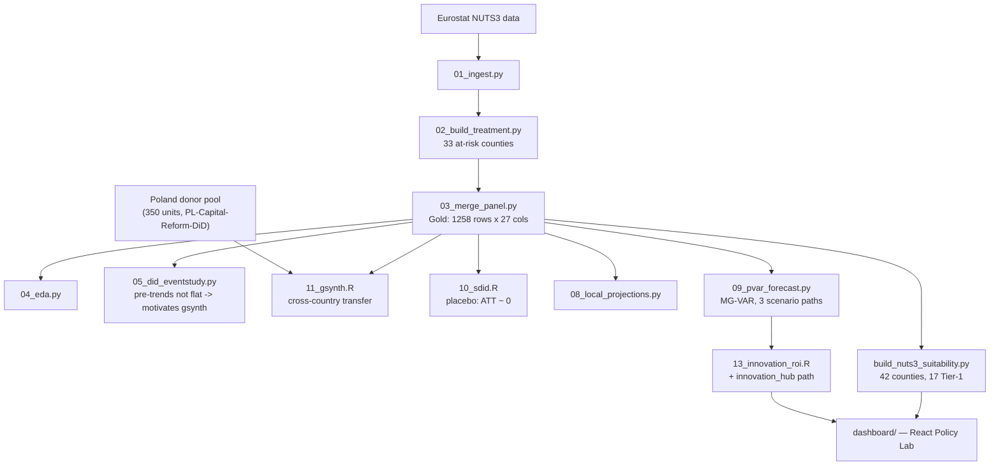

# RO-Administrative-Reform

   

> Applies the causal inference framework from [PL-Capital-Reform-DiD](https://github.com/andrm101/pl-capital-reform-did) to Romania's proposed 2023–2025 administrative reform, under which ~33 county seats (județe) would lose capital status — a near-identical shock to Poland's 1999 reform.

Phase 2 of the three-project research programme (`../VISION.md`).

---

## Key findings

- **`provisional=true`** across every estimate — Romania's reform has not occurred, so treatment effects are transferred/counterfactual (cross-country synthetic control from Poland), not observed post-treatment causal effects
- Placebo SDiD ATT ≈ 0 on all outcomes pre-treatment, exactly as an honest identification strategy should show
- NUTS3 suitability scoring: 42 Romanian counties, **17 Tier-1**, linking into the MegaCampus siting programme
- Mixed-Group Panel VAR forecasts 2025–2040 across status-quo / counterfactual / innovation-hub scenario paths
- Out-of-sample calibration gate does **not** yet pass — flagged honestly rather than glossed over, pending real post-reform data

## What it delivers

1. Historical pre-reform panel (1995–2024) at NUTS3 level for all 42 Romanian counties
2. Cross-country generalized synthetic control estimates using Poland as donor pool (383 units, 350 Polish donors)
3. Mixed-Group Panel VAR forecasts across status-quo / counterfactual / innovation-hub scenarios
4. NUTS3 suitability scoring (42 counties, 17 Tier-1)
5. Policy Lab interface for exploring scenario trade-offs

---

## Architecture



---

## Statistical rigour

> Because Romania's reform has not yet occurred, treatment effects are transferred/counterfactual estimates (via cross-country synthetic control from Poland), not observed post-treatment causal effects — the dashboard and reports explicitly flag `provisional=true` until an out-of-sample calibration gate passes on real post-reform data.

---

## Status

Core estimation pipeline (stages 01–05, 08–11, 13) and NUTS3 suitability analysis are complete; a React policy dashboard is built. Reform impact estimates remain honestly labeled **provisional**.

---

## Running it

```bash
conda env create -f environment.yml
python scripts/01_ingest.py
python scripts/run_r_stages.py
cd dashboard && npm install && npm run dev
```
